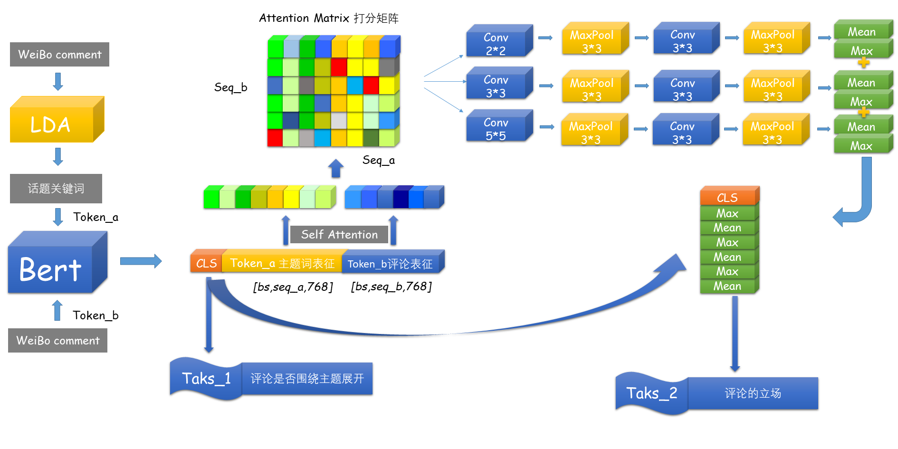

# WeiBo-StandPoint-Dectect
中文微博立场检测（Fly Ai比赛）
* 竞赛数据为NLPcc2016中文微博评论，共5个话题，3种立场（支持、反对、None）。使用Albert作为骨干特征抽取器。
* 创新点之一：使用LDA抽取出每个话题的若干个主题短语，作为bert的token_a，微博主体评论作为token_b,增加辅助任务：判断评论（token_b）是否围绕token_a展开，使用立场为None的数据作为负例，其他作为正例。
* 创新点之二：使用bert抽取出的主题短语集和评论的句向量，使用Attention的方式构造出打分矩阵，使用两层CNN、池化层进行理解，得到立场分类logits。整体F1得分67。
* 架构图：

